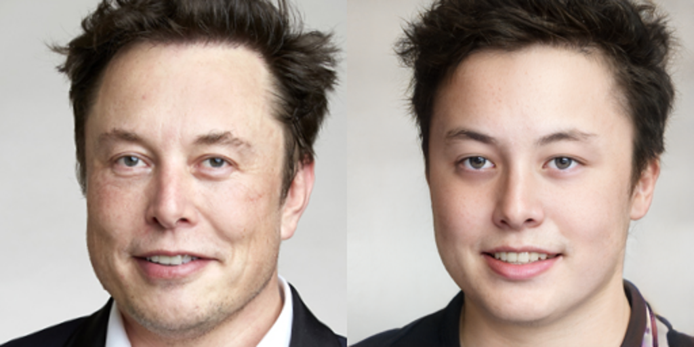
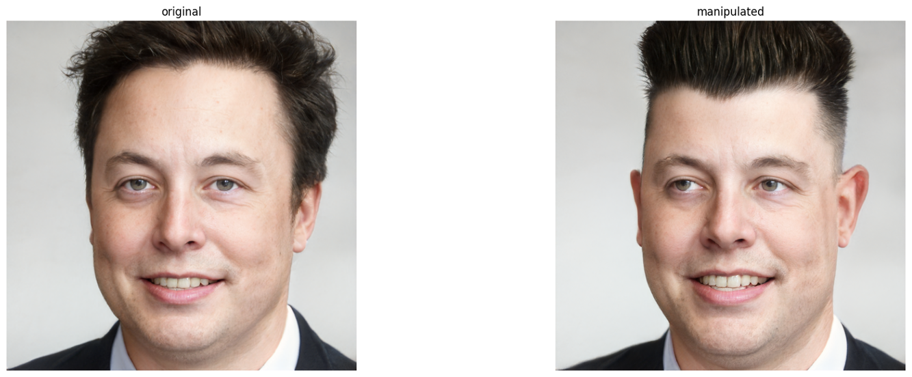

# InterFaceGAN and StyleCLIP
이 Notebook은 Max Woolf라는 분이 [original StyleCLIP repo](https://github.com/orpatashnik/StyleCLIP)에 포함된 [original Colab notebook](https://colab.research.google.com/github/orpatashnik/StyleCLIP/blob/main/notebooks/StyleCLIP_global.ipynb)을 수정한 것을 제가 OCI Jupyter Notebook 환경에서 실행할 수 있도록 재구성한 것입니다.

1. InterFaceGAN
GAN에서 Latent Space(잠재 공간)를 조작해서 이미지를 변형하는 방법중 하나로, 생성한 이미지에서 특정 속성(예: 나이, 성별, 미소 등)을 조작할 수 있습니다. InterFaceGAN은 특히 얼굴 이미지 생성 및 조작에 많이 사용되고 있습니다.  
**실습 노트북:** gan_latent_vector_for_styleclip.ipynb

2. StyleCLIP
StyleCLIP은 StyleGAN2와 CLIP을 결합한 기술로, 텍스트 설명을 통해 이미지 스타일을 조작할 수 있는 매우 강력한 이미지 생성 및 변형 방법입니다. 실습 노트북은 StyleCLIP의 3가지 이미지 조작 방법중에서 Global directions를 활용한 실습을 해볼 수 있습니다.   
**실습 노트북:** styleclip_global_directions.ipynb

OCI Resource Manager에서 바로 배포하여 테스트해볼 수 있는 스택입니다. 배포는 **Ashburn** Region에 배포되고, 사용하는 Shape은 **VM.GPU2.1**입니다. * Ashburn Region 구독 및 VM.GPU2.1 리소스 Limit 체크 필요합니다.  
[](https://cloud.oracle.com/resourcemanager/stacks/create?region=us-ashburn-1&zipUrl=https://github.com/the-team-oasis/genaitf-gandemo-rm/archive/refs/heads/main.zip)

## Setup
* CUDA 11.0, Python 3.7, Pytorch 1.7.1, Tensorflow-gpu 1.15 번에서 실행할 수 있습니다.
* 기본 노트북 위치 디렉토리는 ***/home/opc/demo/notebooks/styleclip_global_directions*** 입니다.

### Jypyter설치(opc 유저)
```
$ conda activate base
$ conda install -c conda-forge jupyterlab  ipywidgets
$ nohup jupyter lab --ip 0.0.0.0 --port 8888 &
```

### 커널 설정
```
$ conda create -n styleclip_global_directions_demo python=3.7
$ conda activate styleclip_global_directions_demo
$ conda install -c conda-forge ipykernel ipywidgets
$ python -m ipykernel install --user --name styleclip_global_directions_demo --display-name "styleclip_global_directions_demo"
```

### 라이브러리 설치
```
$ pip install torch==1.7.1+cu110 torchvision==0.8.2+cu110 torchaudio==0.7.2 -f https://download.pytorch.org/whl/torch_stable.html

$ pip install ftfy regex tqdm requests matplotlib gdown opencv-python

$ cd /home/opc/demo/notebooks/styleclip_global_directions/content
$ git clone https://github.com/omertov/encoder4editing.git encoder4editing
$ git clone https://github.com/bycloudai/StyleCLIP

$ wget https://github.com/ninja-build/ninja/releases/download/v1.8.2/ninja-linux.zip
$ sudo unzip ninja-linux.zip -d /usr/local/bin/
$ sudo update-alternatives --install /usr/bin/ninja ninja /usr/local/bin/ninja 1

$ conda install -c conda-forge dlib
$ conda install -c anaconda tensorflow-gpu==1.15
$ pip install git+https://github.com/openai/CLIP.git
```

### Pretrained Model 다운로드 및 업로드
e4e_ffhq_encode.pt 모델은 StyleGAN과 관련된 모델로 주어진 얼굴 이미지를 StyleGAN의 잠재 공간으로 인코딩합니다. 모델은 아래 HuggingFace에서 다운로드 받을 수 있습니다.
[e4e_ffhq_encode.pt](https://huggingface.co/AIRI-Institute/HairFastGAN/blob/main/pretrained_models/encoder4editing/e4e_ffhq_encode.pt)

다운로드 받은 모델은 /home/opc/demo/notebooks/styleclip_global_directions/content/encoder4editing/pretrained_model 폴더에 업로드 합니다.

### 입력 데이터 준비
StyleCLIP에서 입력 데이터를 준비하기 위한 과정으로 아래 명령어들은 주로 StyleGAN의 잠재 공간을 이해하고 조작하기 위해 필요한 다양한 코드 벡터를 생성하는 데 사용됩니다. 아래 명령어를 실행합니다.

```
$ cd /home/opc/demo/notebooks/styleclip_global_directions/content/StyleCLIP/global/
$ python GetCode.py --dataset_name ffhq --code_type 'w' 
$ python GetCode.py --dataset_name ffhq --code_type 's' 
$ python GetCode.py --dataset_name ffhq --code_type 's_mean_std' 
```

### 테스트용 이미지 업로드
아래 경로에 샘플용 이미지를 업로드 합니다. 샘플용 이미지는 레파지토리의 images/elon-musk.jpg 파일입니다.  

```
/home/opc/demo/notebooks/styleclip_global_directions/images
```

## 실행 결과
### Aligned Image 생성


### Inference 수행 및 Latent 생성


### InterfaceGAN Age Direction 조작


### InterfaceGAN Age Range 조작


### InterfaceGAN 다양한 Direction 조작


### SeFa(Semantic Factorization)를 활용하여 StyleGAN으로 생성된 이미지의 잠재 벡터(latents) 조작


### StyleCLIP 이미지 조작
**target='face with Hi-top fade hair'**  


**target='smiling face with Hi-top fade hair'**  
